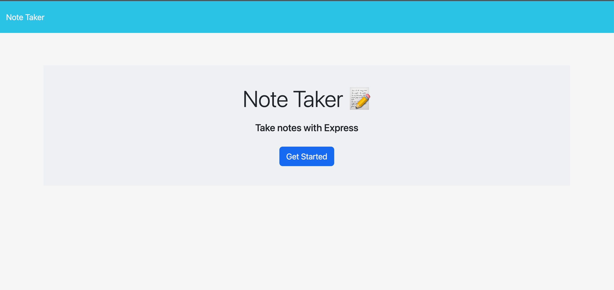
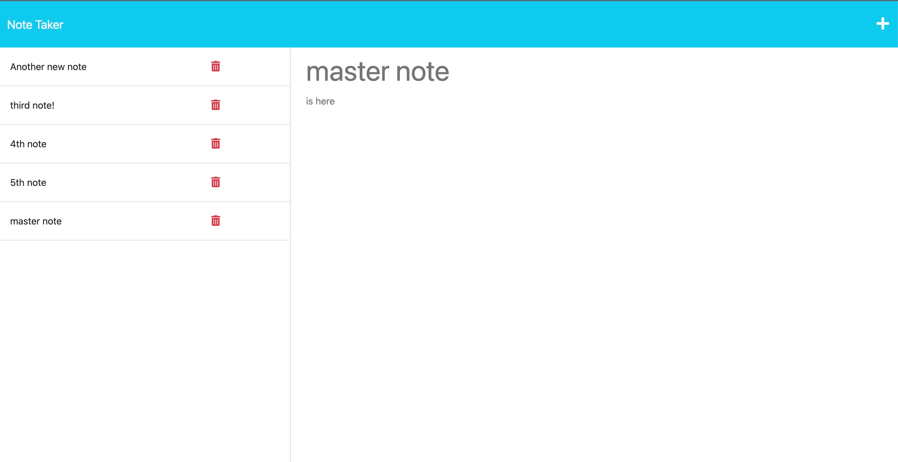

# 11 Express.js: Note Taker

## Your Task

Your assignment is to modify starter code to create an application called Note Taker that can be used to write and save notes. This application will use an Express.js back end and will save and retrieve note data from a JSON file.

The application’s front end has already been created. It's your job to build the back end, connect the two, and then deploy the entire application to Heroku.


## User Story

```
AS A small business owner
I WANT to be able to write and save notes
SO THAT I can organize my thoughts and keep track of tasks I need to complete
```


## Acceptance Criteria

```
GIVEN a note-taking application
WHEN I open the Note Taker
THEN I am presented with a landing page with a link to a notes page
WHEN I click on the link to the notes page
THEN I am presented with a page with existing notes listed in the left-hand column, plus empty fields to enter a new note title and the note’s text in the right-hand column
WHEN I enter a new note title and the note’s text
THEN a Save icon appears in the navigation at the top of the page
WHEN I click on the Save icon
THEN the new note I have entered is saved and appears in the left-hand column with the other existing notes
WHEN I click on an existing note in the list in the left-hand column
THEN that note appears in the right-hand column
WHEN I click on the Write icon in the navigation at the top of the page
THEN I am presented with empty fields to enter a new note title and the note’s text in the right-hand column
```


## Dev Notes
- This application utilizes Express and Node.js to facilitate a server based note taker and storer.
- When hitting the main page, press the "Get Started" button to navigate to the Notes page
- You can either make a new note or view an existing note in the left hand column. 
- Delete button is functional! Go ahead and click the trash can icon to remove a note from the database file. 
- If running this code in VS Code, you can start it with "npm run start"
- However, please navigate to the live URL provided below for all other uses.


## Screenshot
Please see screenshot below for demo of final functionality:


Final notes page here:


## Link to Deployed Heroku Page
Please follow this link below to go to the live URL:
